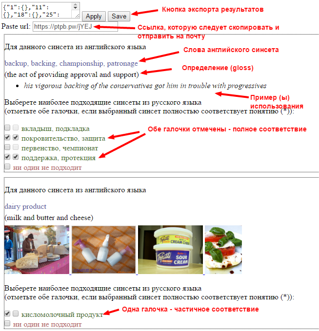

# Croudsourcing test page

## Интерфейс разметки (эксперт)

Пример, как выглядит интерфейс экспертной разметки: 
[Task B](test/index.html?ctx=input/taskB/100shuf.json&template=taskB.hbs).

Каждый блок соответствует ровно одному синсету из PWN, в задании предлагается выбрать несколько (1-3) синсетов из YARN, наиболее близких по смыслу к данному синсету из PWN.

Причем желательно отметить именно _наиболее близкие_ синсеты, т.е. если один синсет существенно лучше других, то другие отмечать не нужно (даже если они тоже являются достаточно близкими понятиями).

Около каждого синсета из YARN расположены 2 галочки. Первую требуется отметить, если настоящий синсет из YARN относится к 1-3 наиболее близких, вторую - только в том случае, когда синсет из YARN определяет ровно тот же смысл, что и синсет из PWN.

В случаях:

* синсет из YARN описывает близкое, но не точно то же понятие из PWN (гипоним/гипероним/мероним/холоним/..)
* синсет из YARN содержит "лишние слова", т.е. требуется некоторая редактура

Ставить вторую галочку **не следует**.

Если ни один из предложенных синсетов не подходит, требуется выбрать соответствующую галочку (_Ни один не подходит_).

См. пример:

(В примере для английского синсета "dairy product" отлично бы подошёл русский "молочный продукт", "кисломолочный продукт" - достаточно близкий гипоним, потому также может быть выбран (т.к. гипоним, соответствие частичное))

### Экспорт результатов

По окончании разметки, нажмите кнопку **Save** в начале страницы. В поле **Paste url** отобразится ссылка - её следует скопировать и отправить по почте [Георгию Агапову](mailto:george.agapov@gmail.com), по ней лежат результаты.

Посмотреть сохраненные результаты можно, добавив параметр `&res=<paste url>` к адресу страницы.

## 100shuf

Тестовая выборка из 100 (случайно выбранных) noun BCs.

* [Все синсеты](test/index.html?ctx=input/taskB/100shuf.json&template=taskB.hbs)
* [Часть 1/3](test/index.html?ctx=input/taskB/100shuf.1.json&template=taskB.hbs)
* [Часть 2/3](test/index.html?ctx=input/taskB/100shuf.2.json&template=taskB.hbs)
* [Часть 3/3](test/index.html?ctx=input/taskB/100shuf.3.json&template=taskB.hbs)

В виде разбиения на задания (Toloka-like): [ссылка](test/index.html?ctx=input/taskA/100shuf.json&template=taskA.hbs).

Результаты:

* [@agapov](test/index.html?ctx=input/taskB/100shuf.json&template=taskB.hbs&res=input/taskB/100shuf/output.agapov.json)
* [@degteva](test/index.html?ctx=input/taskB/100shuf.json&template=taskB.hbs&res=input/taskB/100shuf/output.degteva.json)
* [merged](test/index.html?ctx=input/taskB/100shuf.json&template=taskB.hbs&res=input/taskB/100shuf/output.expert.json)
* [@degteva, merged comparison](test/index.html?ctx=input/taskB/100shuf.json&template=taskBc.hbs&res=input/taskB/100shuf/compare-degteva-expert.json)

Сравнение с результатами аггрегации (croudsourcing, pools ## 12, 20):

* [full](test/index.html?ctx=input/taskB/100shuf.json&template=taskBc.hbs&res=input/taskB/100shuf/compare-expert-20.json)
* [disagreement](test/index.html?ctx=input/taskB/100shuf.json&template=taskBc.hbs&res=input/taskB/100shuf/compare-expert-20.1.json)

